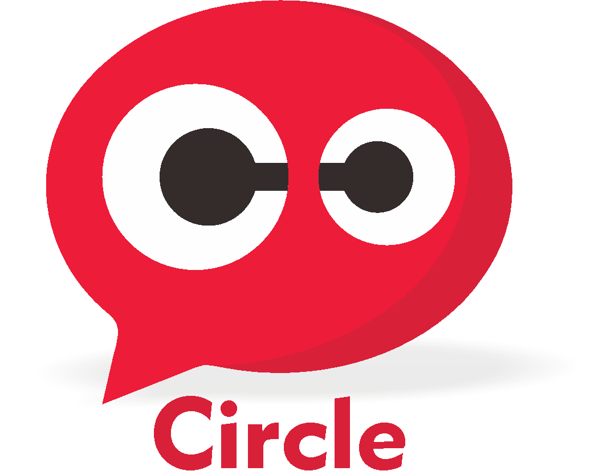

<p align="center">
  
</p>
<p align="center">
  Built with React Native.
</p>

## What is Circle ?
<b>Circle</b> is an application to share messages and locations in realtime, in Circle we can send messages to friends while monitoring their location.

## Features
* Authentication with firebase
* Monitor your friend's location in realtime
* Chat with your friends

## Requirements
* [`yarn`](https://yarnpkg.com/getting-started/install)
* [`react-native`](https://facebook.github.io/react-native/docs/getting-started)
* `Google maps API Key` you can get it [here](https://developers.google.com/maps/documentation/javascript/get-api-key)
* `Config realtime database firebase for WEB` you can get it [here](https://firebase.google.com/)
#### Example config
```
const firebaseConfig = {
  apiKey: "YOUR_apiKey",
  authDomain: "YOUR_authDomain",
  databaseURL: "YOUR_databaseURL",
  projectId: "YOUR_projectId",
  storageBucket: "YOUR_storageBucket",
  messagingSenderId: "YOUR_messagingSenderId",
  appId: "YOUR_appId",
  measurementId: "YOUR_measurementId"
};
```
